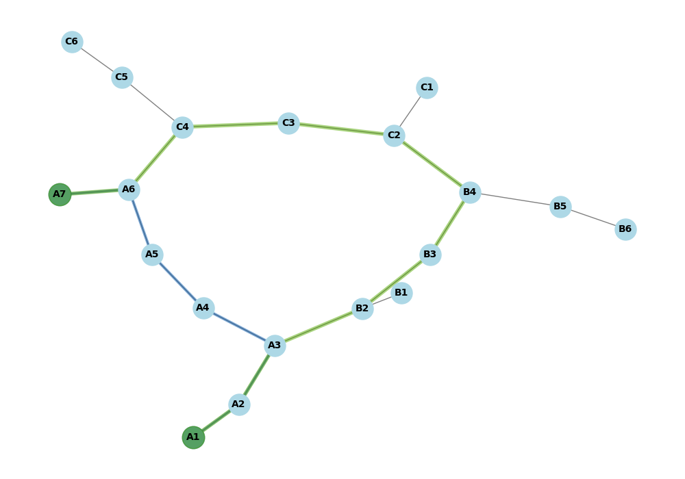

### Порівняння BFS та DFS

#### 1. **BFS (Пошук в ширину)**:
- **Отриманий шлях**: `['A1', 'A2', 'A3', 'A4', 'A5', 'A6', 'A7']`
- **Принцип роботи BFS**: BFS шукає шлях рівнями — спочатку оглядає всі суміжні вершини для поточної вершини перед тим, як перейти на наступний рівень. Таким чином, алгоритм обирає найкоротший шлях між станціями.

#### 2. **DFS (Пошук в глибину)**:
- **Отриманий шлях**: `['A1', 'A2', 'A3', 'B2', 'B3', 'B4', 'C2', 'C3', 'C4', 'A6', 'A7']`
- **Принцип роботи DFS**: DFS йде якнайглибше в одному напрямку, перш ніж повернутися і досліджувати інші гілки. Тому, коли він досягає `A3`, замість того, щоб продовжувати шлях до `A7`, він спочатку йде по гілці B і тільки після цього повертається до зеленої гілки.

### Висновок:
- **BFS** підходить для пошуку найкоротшого шляху в графі з мінімальною кількістю ребер.
- **DFS** досліджує граф глибше і може знаходити складніші шляхи, не завжди гарантуючи найкоротший шлях.
